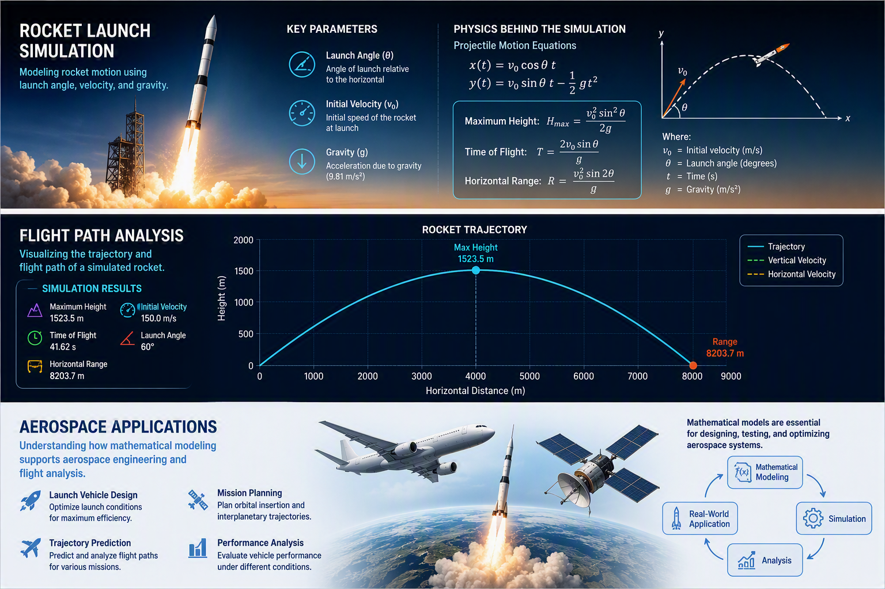

# Rocket Trajectory Simulator 

A Python-based engineering project that simulates the trajectory of a rocket using fundamental physics and projectile motion equations.

## Project Objective

The purpose of this project is to explore how launch angle and initial velocity affect rocket flight performance through mathematical modeling and simulation.

## Research Question

How do launch angle and initial velocity influence a rocket's maximum height, flight time, and horizontal range?

## Engineering Areas
- Aerospace Engineering
- Physics
- Mathematical Modeling
- Python Programming
- Data Visualization
- 
## Project Features

### Maximum Height Calculation
Calculate the highest point reached during flight.

### Flight Time Calculation
Determine how long the rocket remains in the air.

### Horizontal Range Calculation
Estimate the total distance traveled.

### Trajectory Visualization
Display the rocket's flight path using graphical plots.

## Physics Concepts

- Projectile Motion
- Gravity
- Velocity Components
- Flight Dynamics
- Mathematical Modeling
- 
## Skills Demonstrated

- Python Programming
- Aerospace Fundamentals
- Physics-Based Simulation
- Data Analysis
- Mathematical Modeling
- Engineering Problem Solving

## Future Improvements

- Air Resistance Simulation
- Thrust Modeling
- Multi-Stage Rockets
- Variable Gravity Environments
- Interactive User Interface

## Project Files

- [Python Source Code](rocket_trajectory_simulator.py)
- [Project Visual](rocket_trajectory_simulator.jpg)
- [Engineering Notebook](Rocket_Trajectory_Simulator_Engineering_Notebook_Summary.pdf)
- [Project Report ](Rocket_Trajectory_Simulator_Project_Report.pdf)

## Author

Sarp AKAR

Aug 2026

